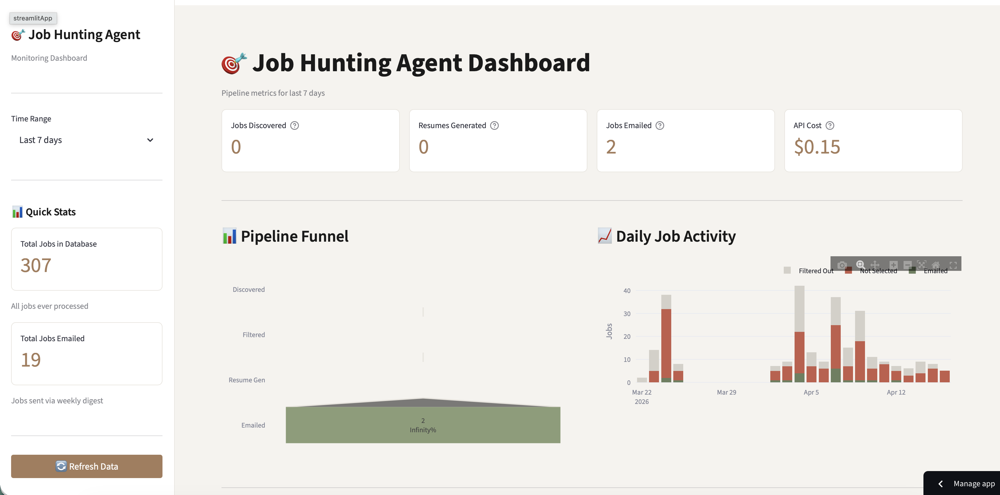

# Job Hunting Agent Dashboard

**[View Live Dashboard](https://job-hunting-dashboard.streamlit.app/)**

A monitoring dashboard for my AI-powered job hunting automation pipeline.



## What This Shows

This dashboard visualizes metrics from my job hunting automation:

- **Jobs Discovered** — New positions found from job boards
- **Pipeline Funnel** — Conversion from discovery → filtering → resume generation → email
- **API Costs** — Claude API usage for matching and resume tailoring
- **Daily Activity** — Job flow over time
- **Error Tracking** — Failed jobs for debugging

## Architecture

```
┌─────────────────────────────────────────────────────────────────┐
│                        Private Repo                              │
│                    (job-hunting-agent)                           │
│  ┌─────────────┐  ┌─────────────┐  ┌─────────────┐              │
│  │  Discovery  │→ │  Matching   │→ │   Resume    │→ Email       │
│  │  (4 sources)│  │ (Claude API)│  │  (Claude)   │              │
│  └─────────────┘  └─────────────┘  └─────────────┘              │
│         │                │                │                      │
│         └────────────────┼────────────────┘                      │
│                          ↓                                       │
│                    ┌───────────┐                                 │
│                    │ Supabase  │ ← writes (service_role key)     │
│                    │ Database  │                                 │
│                    └───────────┘                                 │
└─────────────────────────────────────────────────────────────────┘
                           ↓
                     reads (anon key)
                           ↓
┌─────────────────────────────────────────────────────────────────┐
│                        Public Repo                               │
│                  (job-hunting-dashboard)                         │
│                                                                  │
│  ┌─────────────────────────────────────────────────────────┐    │
│  │              Streamlit Dashboard                         │    │
│  │  • KPI Cards    • Funnel Chart    • Cost Breakdown      │    │
│  │  • Daily Chart  • State Breakdown • Error Table         │    │
│  └─────────────────────────────────────────────────────────┘    │
└─────────────────────────────────────────────────────────────────┘
```

## Security

The dashboard uses Supabase **Row Level Security (RLS)**:

- **Pipeline** (private repo) uses `service_role` key → can read and write
- **Dashboard** (this repo) uses `anon` key → can only read

The anon key is safe to expose because RLS policies restrict it to SELECT only.

## Local Development

1. Clone the repo:
```bash
git clone https://github.com/yourusername/job-hunting-dashboard.git
cd job-hunting-dashboard
```

2. Create virtual environment:
```bash
python -m venv venv
source venv/bin/activate  # or `venv\Scripts\activate` on Windows
pip install -r requirements.txt
```

3. Set up secrets:
```bash
cp .streamlit/secrets.toml.example .streamlit/secrets.toml
# Edit secrets.toml with your Supabase credentials
```

4. Run the dashboard:
```bash
streamlit run app.py
```

## Deploy to Streamlit Cloud

1. Push this repo to GitHub (public)
2. Go to [share.streamlit.io](https://share.streamlit.io)
3. Connect your GitHub repo
4. Add secrets in the Streamlit Cloud dashboard:
   - `SUPABASE_URL`
   - `SUPABASE_PUBLISHABLE_KEY`
5. Deploy

## Tech Stack

- **Frontend**: Streamlit, Plotly
- **Database**: Supabase (PostgreSQL)
- **Styling**: Custom CSS with portfolio color palette

## Color Palette

| Color | Hex | Usage |
|-------|-----|-------|
| Terracota | `#A67C5B` | Primary, accents |
| Verde Oliva | `#6B7F5E` | Success, secondary |
| Verde Claro | `#8B9D77` | Accent |
| Bege Creme | `#F5F3EF` | Background |
| Vermelho Terroso | `#C45C4A` | Errors |

---

Built as part of my AI/ML Engineering portfolio.
